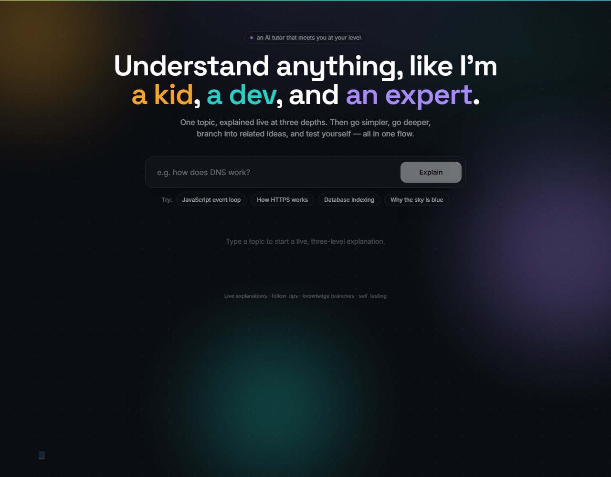
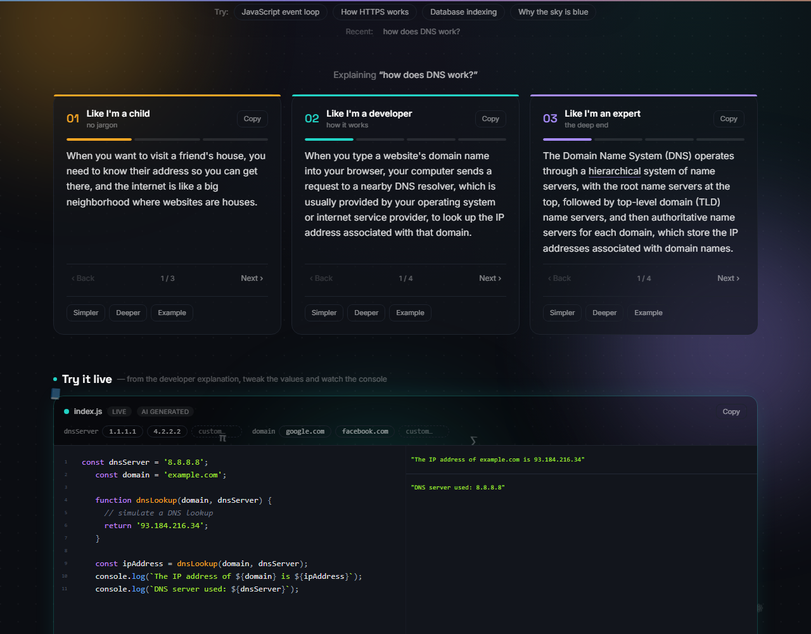
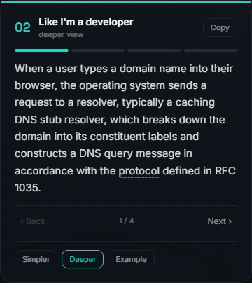
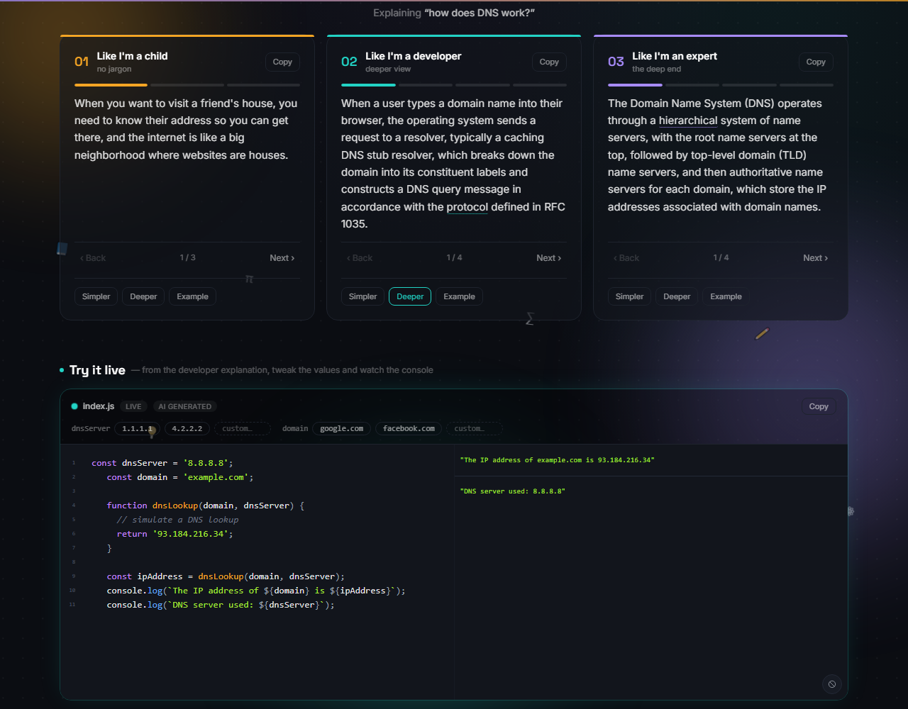
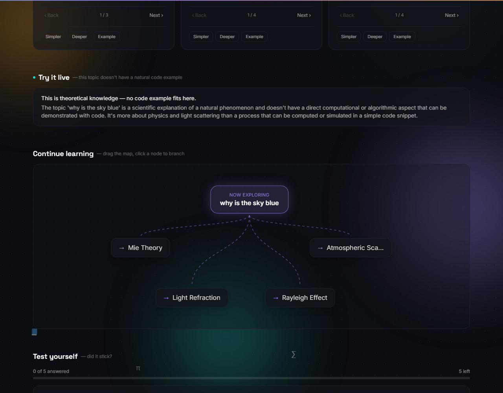
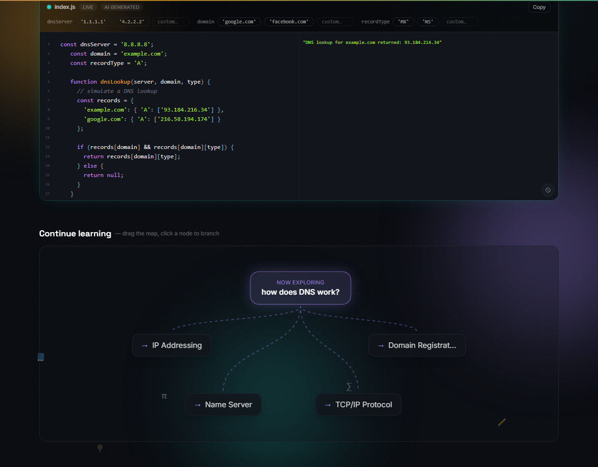
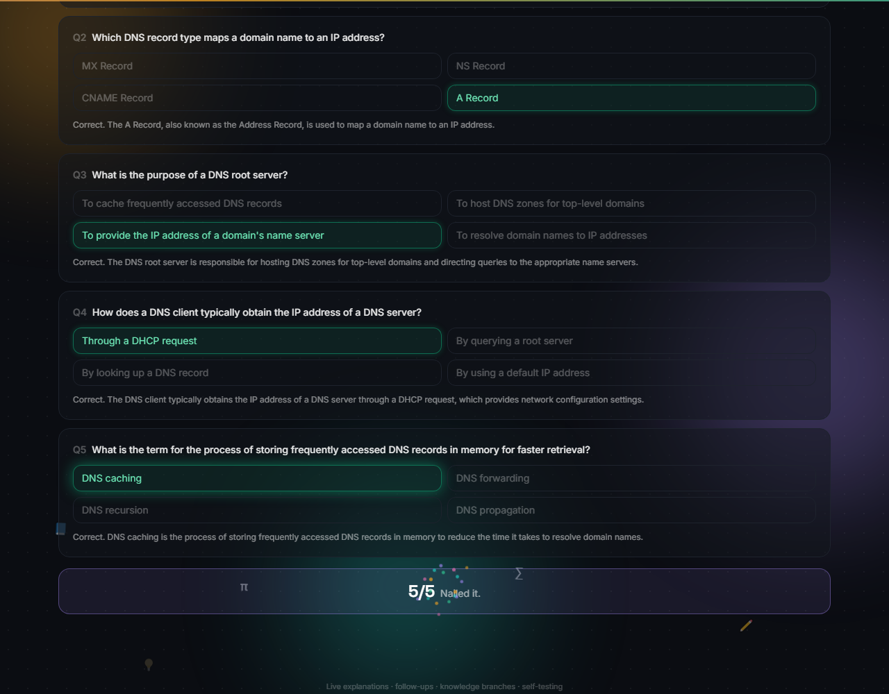
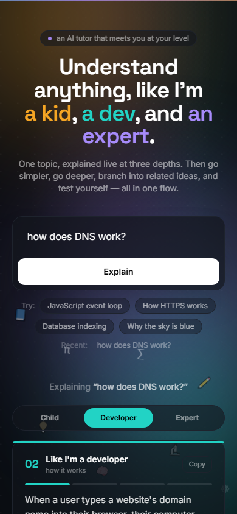

# Explain Any Level — AI learning tutor

**Most AI explainers give you one answer at one depth, and you find out it was the wrong one after you've already read it.** This one streams the same topic at three depths simultaneously — child, developer, expert — so you pick the level that fits *after* seeing all three, not before. Then go simpler, go deeper, branch into related ideas, try the concept as running code, and test yourself. All in one flow, no page reloads, no re-typing your question.

Built with Next.js 14, TypeScript, Tailwind CSS, Framer Motion, and Groq (streaming).



## Features

### 1. Live three-level streaming explanations

Type one topic and get three explanations streaming in at once, side by side — a curious 8-year-old's version, a working developer's version, and a domain expert's version. No waiting for one to finish before the next starts, and no picking a depth up front and hoping it's the right one. Long explanations are broken into short, swipeable "story" slides (segmented progress bar, tap or arrow keys to page through), and jargon words get a subtle underline with a hover/tap definition popover — so the expert-level card stays readable without a glossary tab open on the side.



### 2. Follow-up actions on every card

Each card has its own **Simpler**, **Deeper**, and **Example** buttons — re-streams just that one card in place, at that new angle, without touching the other two or losing your spot.



### 3. "Try it live" — an AI-generated, editable code playground

For topics that are actually about a mechanism (algorithms, protocols, data structures, browser/JS behavior), the developer explanation gets a matching runnable JavaScript snippet in a live sandboxed editor with a console. Every tweakable value in the snippet gets one-click preset chips *and* a free-typed custom-value input — change `dnsServer` from `'8.8.8.8'` to your own value, hit Enter, and watch the console output update immediately. No page reload, no manual re-run.



### 4. Smart detection of non-code topics

Not everything reduces to a code demo, and forcing one is worse than not having one. Before generating a snippet, the model first decides whether the topic actually has a natural computational mechanism. For purely factual, historical, or conceptual topics — "why is the sky blue," "history of Rome" — it skips the contrived example and instead shows genuine context on why a code demo doesn't fit here.



### 5. Continue learning — an interactive knowledge map

The AI suggests four closely related concepts, laid out as a draggable skill-tree graph branching off your current topic. Click any node to branch the whole app into that topic — new three-level explanations, new code playground, new quiz, new branches — building a chain of ideas instead of a dead-end answer.



### 6. Test yourself — a 5-question AI-generated quiz

Five multiple-choice questions generated from the specific explanation you just read, each with a one-line "why" revealed after you answer. A perfect score gets a confetti burst — small payoff, but it makes finishing the loop feel like finishing something.



### 7. Mobile-friendly tab switcher

Three side-by-side cards don't fit a phone screen, so below the `md` breakpoint the layout switches to a segmented Child / Developer / Expert tab bar with one card at a time. The active tab's pill and the card underneath both use Framer Motion layout animation, so switching tabs morphs smoothly instead of flashing or jump-cutting.



### 8. Recent history

Your last 6 topics are kept in `localStorage` and shown as one-click chips under the search box — no account, no backend, just pick up where you left off.

## Run locally

```bash
npm install
# create .env.local with your key (see below)
npm run dev
```

Open http://localhost:3000

## API key

1. Get a free key at https://console.groq.com/keys
2. Create a file named `.env.local` in the project root with:
   ```
   GROQ_API_KEY=your_key_here
   ```
3. Restart the dev server after adding it.

## Deploy to Vercel

1. Push this folder to a GitHub repo.
2. Import it at https://vercel.com/new
3. Add an environment variable `GROQ_API_KEY` with your key.
4. Deploy → you get a live URL.

The key stays server-side in the API routes and is never exposed to the browser.

> **Note:** `/api/stream` runs on the Node.js serverless runtime rather than Vercel's Edge Runtime — the streaming proxy hung indefinitely under Edge in production during testing. `/api/extras` and `/api/code` stay on Edge since they're plain (non-streaming) JSON responses.

## Architecture

```
User types a topic
      │
      ├─► POST /api/stream  ×3 (child, developer, expert)  ── streaming text ──► three cards fill live
      │        (also used for Simpler / Deeper / Example follow-ups)
      │
      ├─► POST /api/extras  ── JSON ──► related concepts + 5-question quiz
      │
      └─► POST /api/code    ── JSON ──► { applicable: true, code, variables }
                                          or { applicable: false, reason }
```

## Roadmap

- Concept diagrams (mermaid) generated per topic.
- Shareable permalink per explanation.
- Voice narration of each level.
- Spaced-repetition review of past topics.

## License

MIT
